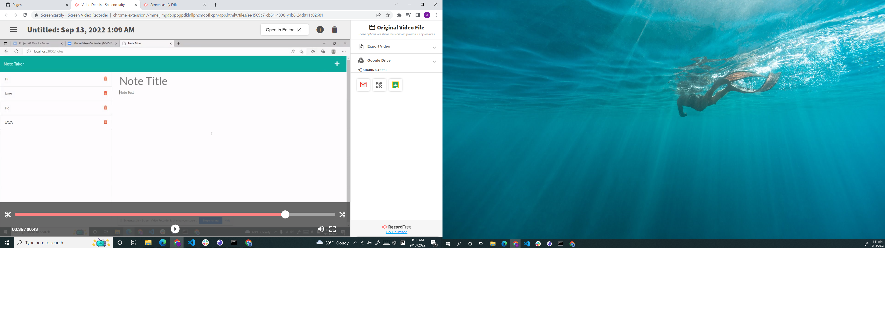

# Unit 11: Note Taker

## Description
This simple note taking application allows you to save notes with a title and plain text. Using ExpressJS,this app create text file and deleting notes.

## Table of Contents

- [Description](#description)
- [User Story](#user-story)
- [Acceptance Criteria](#acceptance-criteria)
- [Using](#Using)
- [Screenshot](#screenshot)
- [Deployed link](#Deployed-link)
- [Repo link](#Repo-link)
- [Video](#Video)
- [Authors](#Authors)

# User Story

```md
I want to create and delete Note.
```

## Acceptance Criteria

```md
GIVEN a note-taking application
WHEN I open the Note Taker
THEN I am presented with a landing page with a link to a notes page
WHEN I click on the link to the notes page
THEN I am presented with a page with existing notes listed in the left-hand column, plus empty fields to enter a new note title and the note’s text in the right-hand column
WHEN I enter a new note title and the note’s text
THEN a Save icon appears in the navigation at the top of the page
WHEN I click on the Save icon
THEN the new note I have entered is saved and appears in the left-hand column with the other existing notes
WHEN I click on an existing note in the list in the left-hand column
THEN that note appears in the right-hand column
WHEN I click on the Write icon in the navigation at the top of the page
THEN I am presented with empty fields to enter a new note title and the note’s text in the right-hand column
```
## Using

* HTML
* CSS
* Javascript
* JSON.
* Express.js


## Screenshot

screenshot for generate HTML webpages

 

## Deployed-link

 

## Repo-link

 

## Video


## Authors
JungHan Seo